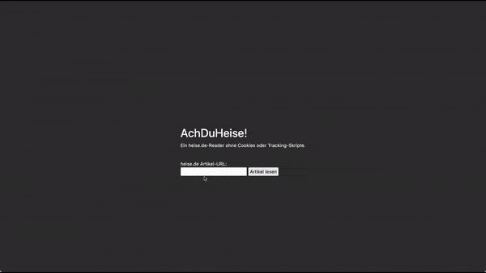

# AchDuHeise!

An open-source frontend for viewing articles from heise.de without cookies, ads or tracking.

## Install/Run (Development)
Currently, only Linux and macOS are supported. Windows users may try to run this application using Microsoft WSL (Windows Subsystem for Linux).
1. Download/Install Python 3.10
2. `python3.10 -m ensurepip --upgrade`
3. Download this project and open a terminal inside it
4. `python3.10 -m venv ./venv venv`
5. `source venv/bin/activate`
6. `pip install -r requirements.txt`
7. `python -m src`

## Known Issues
Check the Issues page. If you find a bug, please open a new issue or PR! :)